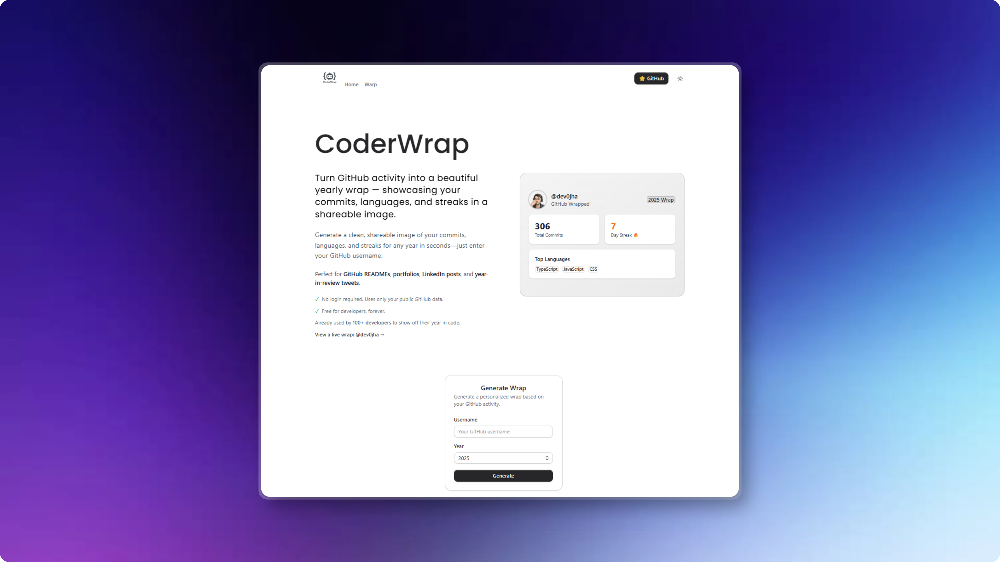

# CoderWrap 🚀

Turn your GitHub activity into a beautiful yearly wrap — showcasing your commits, languages, and streaks in a shareable image.



## ✨ Features

- 🎨 **Beautiful Design** - Clean, modern interface with dark/light mode support
- 📊 **Comprehensive Stats** - Total commits, current streak, top languages, and more
- 🖼️ **Shareable Images** - Download your wrap as a high-quality image
- 🔓 **No Login Required** - Uses only public GitHub data via GitHub API
- ⚡ **Fast & Free** - Generate your wrap in seconds, completely free
- 🌐 **Direct Links** - Share your wrap with custom URLs: `/wrap/[username]/[year]`

## 🎯 Perfect For

- GitHub READMEs
- Developer portfolios
- LinkedIn posts
- Year-in-review tweets
- Showcasing your coding journey

## 🚀 Getting Started

### Prerequisites

- Node.js 20+ or Bun
- npm, yarn, pnpm, or bun

### Installation

```bash
# Clone the repository
git clone https://github.com/dev0jha/CodeWrap.git

# Navigate to the project directory
cd CodeWrap

# Install dependencies
bun install
# or
npm install

# Run the development server
bun dev
# or
npm run dev
```

Open [http://localhost:3000](http://localhost:3000) to see the application.

## 🏗️ Tech Stack

- **Framework:** [Next.js 16](https://nextjs.org/) with React 19
- **Styling:** [Tailwind CSS 4](https://tailwindcss.com/)
- **UI Components:** Custom components with [Base UI](https://base-ui.com/)
- **Animations:** [Motion](https://motion.dev/)
- **Icons:** [Lucide React](https://lucide.dev/)
- **Image Generation:** [html-to-image](https://github.com/bubkoo/html-to-image)
- **Theme:** [next-themes](https://github.com/pacocoursey/next-themes)
- **Package Manager:** [Bun](https://bun.sh/)
- **Monorepo:** [Turborepo](https://turbo.build/)

## 📁 Project Structure

```
codewrap/
├── apps/
│   └── web/                 # Next.js application
│       ├── src/
│       │   ├── app/         # App router pages
│       │   ├── components/  # React components
│       │   ├── lib/         # Utility functions
│       │   └── hooks/       # Custom React hooks
│       └── public/          # Static assets
├── packages/
│   ├── eslint-config/       # Shared ESLint configurations
│   └── typescript-config/   # Shared TypeScript configurations
└── turbo.json              # Turborepo configuration
```

## 🔧 Configuration

The project uses GitHub's public API to fetch user statistics. No API token is required for basic usage, but you may hit rate limits with heavy usage.

## 📝 Usage

1. Visit the homepage
2. Enter your GitHub username
3. Select the year you want to generate
4. View your personalized wrap
5. Download and share!

Example: [View @dev0jha's 2025 wrap](https://codewrap.vercel.app/wrap/dev0jha/2025)

## 🤝 Contributing

Contributions are welcome! Please feel free to submit a Pull Request.

1. Fork the repository
2. Create your feature branch (`git checkout -b feature/AmazingFeature`)
3. Commit your changes (`git commit -m 'Add some AmazingFeature'`)
4. Push to the branch (`git push origin feature/AmazingFeature`)
5. Open a Pull Request

## 📄 License

This project is open source and available under the [MIT License](LICENSE).

## 👨‍💻 Author

**Dev Hari Ojha** ([@dev0jha](https://github.com/dev0jha))

## 🌟 Show Your Support

Give a ⭐️ if this project helped you!

## 📧 Contact

Feel free to reach out if you have any questions or suggestions!

---

**Already used by 100+ developers to showcase their year in code!** 🎉
